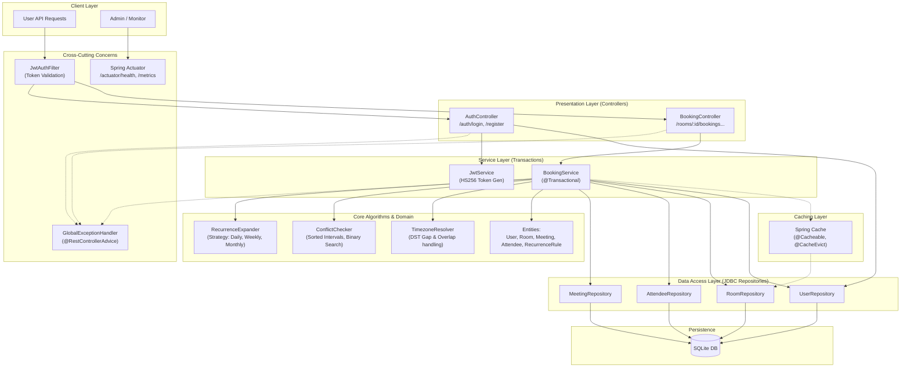

# retrouver

> *« **retrouver** » (French verb): to find again, to retrieve, or reflexively « **se retrouver** » — to meet up, get together, and reunite.*

Meeting room booking system with recurring meeting support (RRULE-based expansion), conflict detection, timezone/DST handling, and series editing (this/future/all) — Java 17 + Spring Boot 3.3 + SQLite.

## Quick Start

```bash
# Prerequisites: Java 17 LTS, Maven 3.9+
mvn clean compile
mvn test                # 59 tests passing, 0 failures
mvn spring-boot:run     # Server starts on http://localhost:8089
```

> **Note:** Default rooms (`room-001` and `room-002`) are automatically seeded into SQLite on startup.

---

## API Reference & Complete cURL Testing Guide

All booking endpoints require an `Authorization: Bearer <token>` header obtained from `/auth/register` or `/auth/login`.

### 1. System Monitoring (Actuator)

```bash
# Health Check (Public probe)
curl -s http://localhost:8089/actuator/health

# Application Metrics
curl -s http://localhost:8089/actuator/metrics
```

### 2. User Authentication

```bash
# Register User (returns JWT token and userId)
curl -s -X POST http://localhost:8089/auth/register \
  -H "Content-Type: application/json" \
  -d '{
    "name": "Raj Gupta",
    "email": "raj@lpu.in",
    "timezone": "Asia/Kolkata",
    "password": "password123"
  }'
# → 201 { "token": "eyJ...", "userId": "uuid-here" }

# Login
curl -s -X POST http://localhost:8089/auth/login \
  -H "Content-Type: application/json" \
  -d '{
    "email": "raj@lpu.in",
    "password": "password123"
  }'
```

### 3. One-Off Bookings & Conflict Detection

```bash
# Book Single Meeting with Attendees (Asia/Kolkata → converts to UTC)
curl -s -X POST http://localhost:8089/rooms/room-001/bookings \
  -H "Content-Type: application/json" \
  -H "Authorization: Bearer $TOKEN" \
  -d '{
    "organizerId": "'$USER_ID'",
    "attendeeIds": ["'$ATTENDEE_ID'"],
    "start": "2027-05-10T10:00:00",
    "end": "2027-05-10T11:00:00",
    "timezoneId": "Asia/Kolkata",
    "title": "Quarterly Sprint Planning"
  }'
# → 201 Created

# Query Attendees & RSVP Status
curl -s -X GET http://localhost:8089/bookings/$BOOKING_ID/attendees \
  -H "Authorization: Bearer $TOKEN"

# Overlapping Conflict Check (Rejects 10:30 to 11:30 clash)
curl -s -X POST http://localhost:8089/rooms/room-001/bookings \
  -H "Content-Type: application/json" \
  -H "Authorization: Bearer $TOKEN" \
  -d '{
    "organizerId": "'$USER_ID'",
    "start": "2027-05-10T10:30:00",
    "end": "2027-05-10T11:30:00",
    "timezoneId": "Asia/Kolkata",
    "title": "Conflicting Meeting"
  }'
# → 409 Conflict: "Room is already booked for the requested time slot"

# Half-Open Interval Rule (11:00 to 12:00 back-to-back touches boundary — SUCCEEDS)
curl -s -X POST http://localhost:8089/rooms/room-001/bookings \
  -H "Content-Type: application/json" \
  -H "Authorization: Bearer $TOKEN" \
  -d '{
    "organizerId": "'$USER_ID'",
    "start": "2027-05-10T11:00:00",
    "end": "2027-05-10T12:00:00",
    "timezoneId": "Asia/Kolkata",
    "title": "Back to Back Meeting"
  }'
# → 201 Created (no false clash)
```

### 4. Recurring Meetings & All-or-Nothing Rejection

```bash
# Book Weekly MWF Recurring Series across timezones (America/New_York)
curl -s -X POST http://localhost:8089/rooms/room-002/bookings/recurring \
  -H "Content-Type: application/json" \
  -H "Authorization: Bearer $TOKEN" \
  -d '{
    "organizerId": "'$USER_ID'",
    "start": "2027-07-05T09:00:00",
    "end": "2027-07-05T09:30:00",
    "timezoneId": "America/New_York",
    "title": "Engineering Standup",
    "horizonEnd": "2027-09-30",
    "rule": {
      "freq": "WEEKLY",
      "intervalN": 1,
      "byDay": ["MO", "WE", "FR"],
      "count": 12
    }
  }'
# → 201 { "success": true, "meeting": {...}, "conflictDates": [] }

# All-or-Nothing Series Conflict (Overlapping Mondays rejected with exact dates)
curl -s -X POST http://localhost:8089/rooms/room-002/bookings/recurring \
  -H "Content-Type: application/json" \
  -H "Authorization: Bearer $TOKEN" \
  -d '{
    "organizerId": "'$USER_ID'",
    "start": "2027-07-05T09:00:00",
    "end": "2027-07-05T09:30:00",
    "timezoneId": "America/New_York",
    "title": "Clashing Monday Series",
    "horizonEnd": "2027-09-30",
    "rule": {
      "freq": "WEEKLY",
      "intervalN": 1,
      "byDay": ["MO"],
      "count": 4
    }
  }'
# → 409 Conflict: { "conflictDates": ["2027-07-05", "2027-07-12", "2027-07-19", "2027-07-26"] }
```

### 5. Series Editing — The 3 Real Choices (THIS / THIS_AND_FUTURE / ALL)

```bash
# 1. Scope THIS: Edit a single occurrence (creates MeetingException override)
curl -s -X PATCH "http://localhost:8089/bookings/$BOOKING_ID?scope=THIS" \
  -H "Content-Type: application/json" \
  -H "Authorization: Bearer $TOKEN" \
  -d '{
    "occurrenceDate": "2027-07-07",
    "newStart": "2027-07-07T14:00:00",
    "newEnd": "2027-07-07T15:00:00"
  }'

# 2. Scope THIS: Cancel a single occurrence (frees slot for that date only)
curl -s -X DELETE "http://localhost:8089/bookings/$BOOKING_ID?scope=THIS&occurrenceDate=2027-07-09" \
  -H "Authorization: Bearer $TOKEN"

# 3. Scope THIS_AND_FUTURE: Edit series split (truncates old, creates child series)
curl -s -X PATCH "http://localhost:8089/bookings/$BOOKING_ID?scope=THIS_AND_FUTURE" \
  -H "Content-Type: application/json" \
  -H "Authorization: Bearer $TOKEN" \
  -d '{
    "occurrenceDate": "2027-07-16",
    "newStart": "2027-07-16T15:00:00",
    "newEnd": "2027-07-16T16:00:00"
  }'

# 4. Scope THIS_AND_FUTURE: Cancel future occurrences (truncates rule UNTIL date)
curl -s -X DELETE "http://localhost:8089/bookings/$BOOKING_ID?scope=THIS_AND_FUTURE&occurrenceDate=2027-07-23" \
  -H "Authorization: Bearer $TOKEN"

# 5. Scope ALL: Edit entire series (re-validates all occurrences with optimistic lock)
curl -s -X PATCH "http://localhost:8089/bookings/$BOOKING_ID?scope=ALL" \
  -H "Content-Type: application/json" \
  -H "Authorization: Bearer $TOKEN" \
  -d '{
    "newStart": "2027-05-10T16:00:00",
    "newEnd": "2027-05-10T17:00:00"
  }'

# 6. Scope ALL: Cancel entire series (marks status CANCELLED)
curl -s -X DELETE "http://localhost:8089/bookings/$BOOKING_ID?scope=ALL" \
  -H "Authorization: Bearer $TOKEN"
```

## Architecture



**Key separation of concerns:** RecurrenceExpander never knows about conflicts. ConflictChecker never knows about recurrence. TimezoneResolver never knows about the domain. They only meet inside BookingService.

## Data Model

6 entities: User, Room, Meeting, RecurrenceRule, MeetingException, Attendee.

- **Meeting** stores `start_utc`/`end_utc` (UTC) + `timezone_id` (IANA zone) — UTC for indexing/comparison, zone ID for DST-correct local time derivation.
- **RecurrenceRule** stores only the pattern (FREQ/INTERVAL/BYDAY/BYMONTHDAY/BYSETPOS/UNTIL/COUNT) — no dtstart, which lives on Meeting per RFC 5545.
- **MeetingException** handles per-occurrence overrides (MODIFIED or CANCELLED).
- **Meeting.version** enables optimistic locking for concurrent booking safety.

## Core Algorithms

### Recurrence Expansion
- **Strategy pattern**: `RecurrenceExpander` interface with `DailyStrategy`, `WeeklyStrategy`, `MonthlyStrategy`. Adding YEARLY = one new class, zero changes elsewhere.
- **Monthly BYMONTHDAY=31**: skips months with fewer days (RFC 5545 behavior) — does NOT clamp to the last day.
- **Monthly BYDAY+BYSETPOS**: computes "2nd Wednesday" / "last Friday" directly using negative indexing.
- **Weekly N-week interval**: anchored to dtstart's week to prevent drift.

### Conflict Checking — O(log n)
- **Sorted list of intervals per room**, binary search for insertion point, check only two neighbors.
- **Half-open intervals**: `[s1,e1)` and `[s2,e2)` overlap iff `s1 < e2 AND s2 < e1`. End time is exclusive — 11:00-end + 11:00-start = no conflict.
- **Batch mode**: for recurring series, fetch the room's index once, check all ~26 occurrences in-memory.

### Timezone / DST Handling
- **Spring-forward gap** (e.g. 02:30 doesn't exist): shift forward by gap duration → 03:30.
- **Fall-back overlap** (e.g. 01:30 happens twice): pick the first occurrence (earlier UTC instant).
- Uses `java.time.ZoneRules.getTransition()` — no manual offset arithmetic.

### Series Editing (THIS / THIS_AND_FUTURE / ALL)
- **THIS**: insert a `MeetingException` (MODIFIED or CANCELLED). Master rule untouched.
- **THIS_AND_FUTURE**: split the series — truncate old rule's UNTIL, create new Meeting + Rule starting at the edit date, move exceptions ≥ that date to the new series.
- **ALL**: edit master Meeting/Rule directly, re-validate ALL future occurrences against conflicts.

## Time/Space Complexity

| Operation | Time | Space |
|-----------|------|-------|
| Single booking conflict check | O(log n) | O(1) |
| Recurring series expansion (k occurrences) | O(k) for Daily, O(days) for Weekly | O(k) |
| Batch conflict check (k occurrences) | O(k log n) | O(k) |
| Series split (THIS_AND_FUTURE) | O(k log n) for re-validation | O(k) |
| Binary search insertion | O(log n) search + O(n) shift | O(1) |

Where n = number of existing bookings in a room, k = number of occurrences in a series.

## Concurrency & Fault Tolerance

- **Declarative Transactions (`@Transactional`)**: All booking operations (single & recurring) run within atomic database transactions. If an insert fails or any recurring slot clashes, all DB writes roll back completely.
- **Optimistic locking**: `UPDATE ... WHERE version = ?` — prevents the race where two requests both pass conflict-checking and both write. Zero-row update = stale → reject and retry.
- **WAL mode**: `PRAGMA journal_mode=WAL` — lets readers proceed concurrently with a writer (SQLite default blocks readers during writes).
- **FK enforcement**: `PRAGMA foreign_keys=ON` — SQLite defaults this to OFF. Without it, RESTRICT/CASCADE constraints are silently decorative.
- **All-or-nothing recurring booking**: if any occurrence in a series conflicts, the entire series is rejected — no partial bookings.

## Caching & Performance Optimization

- **Spring Cache Abstraction**: Active rooms (`/rooms`) are cached in-memory with `@Cacheable(value = "rooms")` to minimize repeated DB queries during high-concurrency room discovery.
- **Cache Eviction**: Adding or deactivating rooms automatically triggers `@CacheEvict(value = "rooms", allEntries = true)`.

## Monitoring & Observability

- **Spring Boot Actuator**: Provides real-time health checks (`/actuator/health`) and application/JVM metrics (`/actuator/metrics`).
- **Structured Error Handling**: Centralized `GlobalExceptionHandler` (`@RestControllerAdvice`) provides uniform JSON error contracts across all endpoints with automated SLF4J audit logging.

## Auth

- **JWT (HS256)**: stateless — the token IS the session. No server-side session store.
- **BCrypt**: deliberately slow password hashing. Prevents brute-force on leaked hashes.
- **Same login error**: "Invalid email or password" for both unknown-email and wrong-password — prevents email enumeration.
- **Endpoint protection**: `/auth/**` and `/actuator/**` are public; business endpoints require `Authorization: Bearer <token>`.

## Design Decisions

See [DECISIONS.md](DECISIONS.md) for the full reasoning behind each choice:

1. dtstart on Meeting, not RecurrenceRule (RFC 5545)
2. java.time over ical4j (hand-written expansion is the assignment's point)
3. Sorted list over interval tree (point-insertion checks only)
4. UTC + IANA zone ID (fixed offset breaks at DST transitions)
5. Half-open `[s,e)` overlap rule (correct boundary behavior)
6. Optimistic locking via version column (prevents concurrent booking race)
7. RESTRICT on Room FK, CASCADE on MeetingException and Attendee FK
8. Spring Boot (DI + ecosystem)
9. JdbcTemplate over JPA (SQLite dialect issues, interview explainability)
10. Stateless JWT over sessions (no server-side state)
11. Atomic series transactions via `@Transactional`
12. Read caching on rooms with mutation eviction
13. Declarative `@Transactional` for atomic All-or-Nothing persistence
14. Read caching on rooms with mutation eviction (`@Cacheable` / `@CacheEvict`)
15. Production observability with Spring Boot Actuator (`/health`, `/metrics`)
16. Centralized exception handling via `@RestControllerAdvice`
17. Custom `StringToUuidConverter` for human-friendly URL slugs (`room-001`)

## Tech Stack

| Component | Choice | Why |
|-----------|--------|-----|
| Language | Java 17 LTS | Switch expressions, records, text blocks |
| Framework | Spring Boot 3.3 | DI, embedded server, security, JDBC, actuator, cache |
| Database | SQLite | Zero-config, file-based, sufficient for case study |
| Persistence | JdbcTemplate | Hand-written SQL, no ORM overhead |
| Auth | Spring Security + JJWT | Stateless JWT (HS256), BCrypt hashing |
| Monitoring | Spring Boot Actuator | Production health and metrics endpoints |
| Testing | JUnit 5 + Mockito | Via spring-boot-starter-test (59 tests passing, 0 failures) |
| Build | Maven | Standard, clean lifecycle |

## Project Structure

```
src/main/java/com/booking/
├── BookingApplication.java          # Spring Boot entry point (@EnableCaching)
├── api/
│   ├── BookingController.java       # REST endpoints + request DTOs
│   ├── GlobalExceptionHandler.java  # Centralized exception envelope
│   └── StringToUuidConverter.java   # Maps friendly slugs (room-001) to UUIDs
├── auth/
│   ├── AuthController.java          # Register + login
│   ├── JwtService.java              # Token generation + validation
│   ├── JwtAuthFilter.java           # Bearer token extraction filter
│   └── SecurityConfig.java          # Spring Security & CORS configuration
├── conflict/
│   └── ConflictChecker.java         # Sorted interval list + binary search
├── domain/
│   ├── Attendee.java                # Attendee entity with RSVP status enum
│   ├── Meeting.java                 # Core entity (UTC times, version lock)
│   ├── MeetingException.java        # Per-occurrence override (MODIFIED/CANCELLED)
│   ├── RecurrenceRule.java          # Pattern-only value object (no dtstart)
│   ├── Room.java                    # Soft-delete via active flag
│   └── User.java                    # IANA timezone, password hash
├── recurrence/
│   ├── RecurrenceExpander.java      # Strategy interface
│   ├── DailyStrategy.java           # Every N days
│   ├── WeeklyStrategy.java          # Every N weeks on chosen weekdays
│   └── MonthlyStrategy.java         # By month day OR by day+setpos
├── repository/
│   ├── DatabaseInitializer.java     # SQLite DDL + auto-seeds default rooms
│   ├── AttendeeRepository.java      # CRUD for attendees
│   ├── MeetingRepository.java       # CRUD + optimistic lock update
│   ├── MeetingExceptionRepository.java
│   ├── RecurrenceRuleRepository.java
│   ├── RoomRepository.java          # Caching + deactivation
│   └── UserRepository.java
├── service/
│   └── BookingService.java          # Orchestrator (@Transactional book/edit/cancel)
└── timezone/
    └── TimezoneResolver.java        # DST gap/fold handling

src/test/java/com/booking/
├── conflict/
│   └── ConflictCheckerTest.java     # 18 tests (overlap, half-open, multi-room, batch)
├── recurrence/
│   └── RecurrenceExpanderTest.java  # 18 tests (all 3 strategies + edge cases)
├── service/
│   └── BookingServiceTest.java      # 9 tests (all-or-nothing, series edit/cancel THIS/FUTURE/ALL, attendees)
└── timezone/
    └── TimezoneResolverTest.java    # 14 tests (gap, overlap, cross-DST recurring)
```
